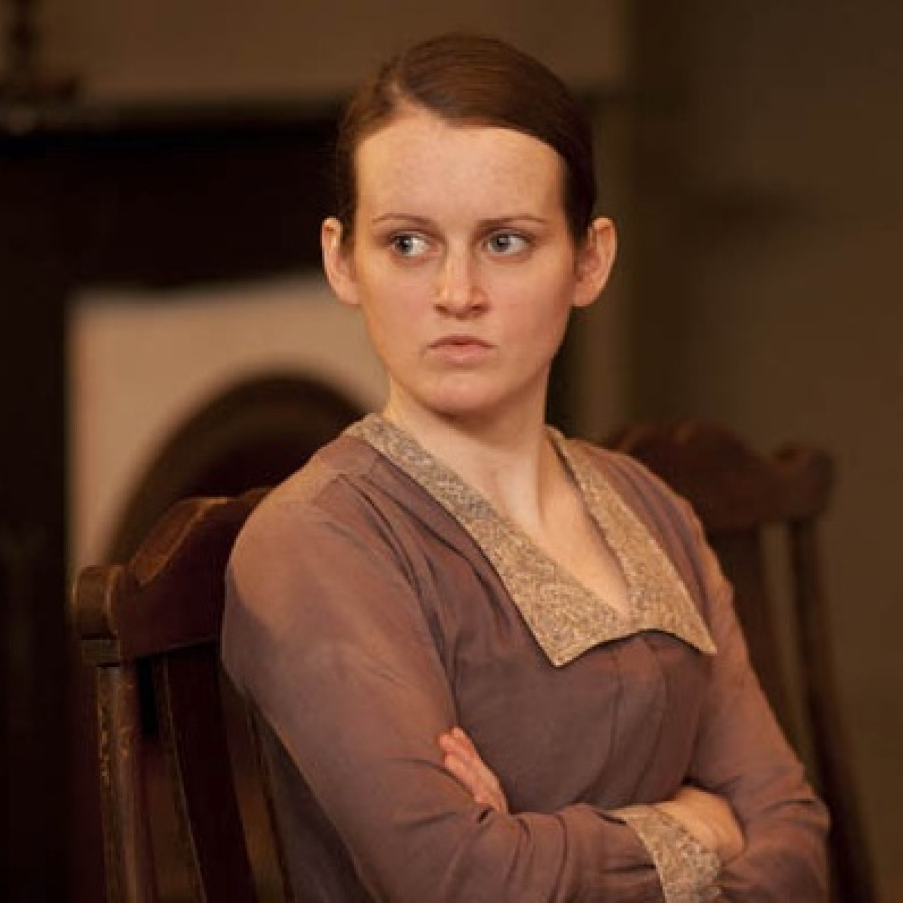

# The Daisy syndrome

A lesson from Downton Abbey

essay

Author

Joram Mutenge

Published

June 3, 2026

To apply logic to matters of the heart is to misunderstand love entirely. Our feelings do not always obey reason. Sometimes we are surprised by the people we fall for. We may know they are not right for us. We may even believe we deserve better. Yet our emotions cling to them anyway. Love is full of contradictions, and perhaps that is one of its defining mysteries.

A few months ago, I heard that a new movie, *Downton Abbey: The Grand Finale*, was in development. As a longtime fan of *Downton Abbey*, I decided to rewatch the series in preparation. It had also been years since I first watched it, and I suspected I would notice things I had missed before. I was right.

This essay, however, is not about my love for *Downton Abbey*, though I certainly have plenty of it. Rather, it’s about a behavioral pattern I noticed in the show, one that feels remarkably common in real life. I call it the Daisy Syndrome, named after Daisy, the young kitchen maid.

Daisy in Downton Abbey

## What is the Daisy syndrome?

Throughout the series, Daisy develops crushes on several of the footmen at Downton. Whenever she likes someone, she becomes deeply invested in winning their attention. She grows jealous of rivals and goes out of her way to show affection. Yet the moment that affection is returned, her interest fades. The pattern repeats itself again and again.

For example, when Alfred showed interest in her, Daisy barely gave him the time of day. But as soon as Alfred began paying attention to Ivy instead, Daisy suddenly became interested in him again. The same thing happened with Andy. While he pursued her, she avoided him and seemed indifferent. But once he stopped chasing her, he became attractive to her almost overnight.

That is the Daisy syndrome: losing interest in someone the moment they begin to like you back.

What makes this pattern especially interesting is that Daisy herself does not recognize it. It takes Mrs. Patmore pointing it out before Daisy begins to see the truth. When Mrs. Patmore tells Anna that Daisy only wants Andy now because he has “given her the brush-off,” Daisy denies it, but deep down she knows it’s true.

The clearest proof comes afterward. Once Andy stops chasing her, Daisy’s feelings intensify. She even fusses over her appearance in an attempt to regain his attention, hoping he will start liking her again.

## The Daisy syndrome in real life

I must confess that I have suffered from the Daisy syndrome myself. There have been moments in my life when I lost interest in someone almost immediately after discovering they liked me back. As irrational as it sounds, there is something deeply seductive about the chase. We are often drawn toward what feels distant, uncertain, or difficult to attain.

Part of the problem may be that we romanticize longing itself. We tend to idealize people who seem slightly out of reach. Their distance increases their value in our minds. But once they become emotionally available, the fantasy collapses. Suddenly they no longer feel extraordinary because they now feel attainable.

This may explain why the idea of “playing hard to get” has persisted for so long. There is some psychological truth behind it. Still, there is a delicate balance. If someone is too available, the excitement disappears. But if they are too unattainable, people eventually stop trying altogether. Nobody enjoys pursuing something they believe they can never have. At the same time, few people are excited by something guaranteed from the beginning.

People often say that “the fun is in the chase.” I think there is truth in that, but only partly. A chase without the possibility of connection eventually becomes exhausting. Desire needs uncertainty, but love needs reciprocity. We want mystery, but we also want to arrive somewhere meaningful in the end.

Is there a logical explanation for the Daisy syndrome? I’m inclined to think there must be, because the pattern is so common. Yet the more I think about it, the harder it becomes to explain convincingly. Why should learning that someone likes us back reduce our attraction to them? Intuitively, it should strengthen it. Mutual affection should feel reassuring, not disappointing.

Perhaps the answer lies in the strange relationship between desire and uncertainty. Or perhaps human emotions are simply more contradictory than we care to admit.

The more I reflect on the Daisy syndrome, the more convinced I become that it belongs to that category of human experiences that reason can describe but never fully explain. Matters of the heart rarely follow the rules we expect them to.

Have you ever experienced the Daisy syndrome? If so, how did you deal with it?
