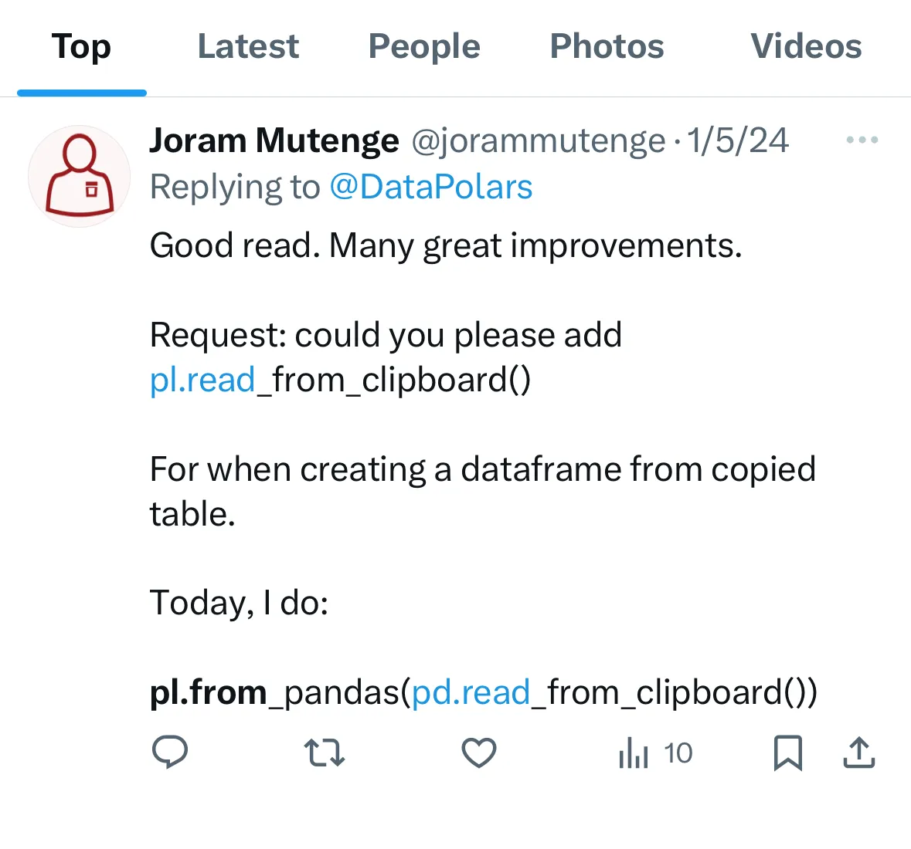
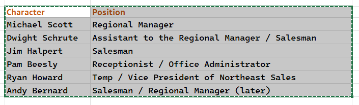

It’s amazing how much the Polars library has improved! I remember sandwiching my polars code with pandas code to perform some operations. Even though the library was deficient for other operations, I didn’t want to let it go because I love it to bits.

There’s one operation I perform a lot in my work, and I wanted polars to have it so I could ditch pandas entirely in my code base.

So I wrote to the Polars team using our modern communication tool, X (or Twitter, for those who refuse to use the new name).

{fig-align="center" width="380" height="360"}

To my surprise, they listened to my request! Now you can create a dataframe from a table copied to your clipboard, without resorting to pandas.

Here’s how to do it.

{fig-alt="A dataframe copied from Excel" fig-align="center"}

I’ve copied the table from Excel containing the names and positions of characters in the popular TV show *The Office*.

```{python}
#| echo: false

import polars as pl

data = {
    "Character": [
        "Michael Scott", 
        "Dwight Schrute", 
        "Jim Halpert", 
        "Pam Beesly", 
        "Ryan Howard", 
        "Andy Bernard"
    ],
    "Position": [
        "Regional Manager",
        "Assistant to the Regional Manager / Regional Manager (later)",
        "Salesman / Co-Regional Manager (later)",
        "Receptionist / Office Administrator",
        "Temp / Vice President of North East Region",
        "Salesman / Regional Manager (later)"
    ]
}

pl.DataFrame(data).write_clipboard()
```

Then I run the following polars code to print the table as a dataframe.

```{python}
import polars as pl

df = pl.read_clipboard()
df
```

<br> And there you have it! To learn more about this fast-growing library, check out my [Udemy course](https://www.udemy.com/course/analyzing-data-with-polars-in-python/)!
