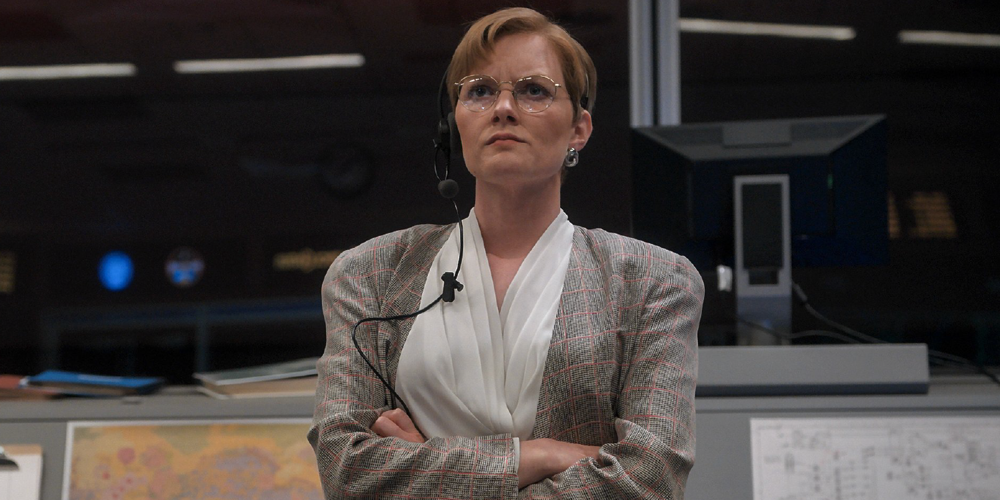

::: {.gray-text .center-text}
{fig-align="left"}
:::

Being in charge is attractive to most people because it gives them the power to boss people around.

But there's another side of being in charge that most people who are in charge don't like to embrace. It's the side that requires you to take ownership when things don't go accordingly.

In the TV show *For All Mankind*, we’re told what being in charge really means.

> That's what it means to be in charge, taking responsibility when things go south.

Being in charge isn’t just about giving people orders. It’s also about taking responsibility when things don't go according to plan.

A leader who blames her subordinates when the execution fails isn't fit to be in charge.

A leader who takes responsibility when the execution fails deserves to be in charge.