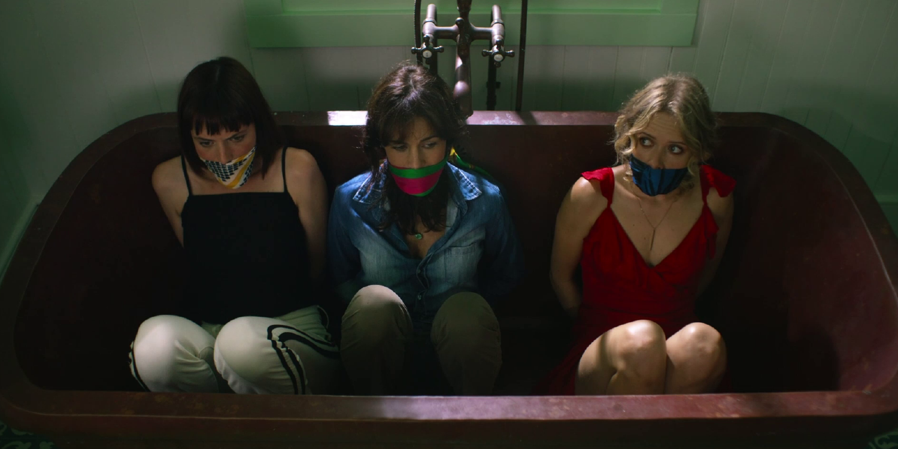

::: {.gray-text .center-text}
{fig-align="left"}
:::

The question: “Are people naturally good or bad?” has plagued humans for ages.

It’s hard to pick a side because we can't deny that there's evil in the world nor can we deny that there's good.

What’s not clear is whether these two opposing qualities are learned or innate. That's why the question is difficult to answer.

In the TV show *Leopard Skin*, which I highly recommend, I heard something that may have answered this age-old question — or at least attempted to answer it.

> Everyone has a sadistic streak as long as you have someone at your mercy.

While difficult to accept, there's some element of truth in this. We've all delighted in other people's misfortunes, misery, or loss. Yet we rarely hear people admit having this feeling publicly.

The reason is that it's a shameful feeling to have. The English language doesn't even have a word for this feeling despite it being common. German on the other hand, has a word for it, schadenfreude.

Does deriving pleasure from other people's failure, pain, or humiliation make you a good person? I'd argue no.

So, if we all have a sadistic streak in us, do we acquire this streak as we grow, or is it ingrained in us from birth? It's hard to answer this definitively.

The plausible answer, it seems to me, is that we're born with this sadistic streak. Evil is part and parcel of the ingredients that make up humans.

You may argue that you don't have a sadistic bone in you, in which case I’d refer you back to the quote:

> Everyone has a sadistic streak as long as you have someone at your mercy.

You, my friend, just don’t have someone at your mercy yet.
