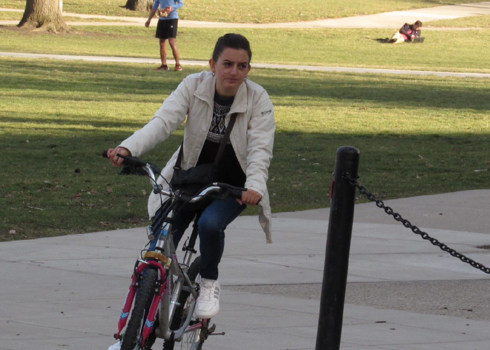
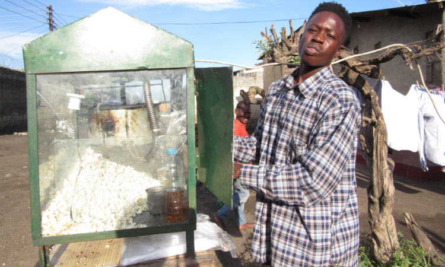

::: {.gray-text .center-text}
{fig-align="center"}
:::

If a bell curve were plotted showing the number of miles each human has cycled throughout their life, I would be on the right side of that bell curve. I've spent most of my leisure time on my bicycle because it’s freeing and refreshing. It's also a good way to rediscover genius in our neglected thoughts -- the thoughts that don't get our attention in the hustle and bustle of the day-to-day.

The other day on one of my bike rides, I noticed the bicycle had been moving slower than usual. I tried to peddle harder but the speed wasn't matching the effort I put into the peddling. Then I noticed that the back tire was a little flat. I needed air in the tire to move at my usual speed.

On my way to the filling station, I began thinking about how this could be a metaphor for the hard work we put in to succeed in life. The advice “hard work pays” is so common it has become a cliché. But sometimes it is not the hard work that matters, but where the hard work is deployed.

Let's return to the metaphor of riding a bicycle with a flat tire. Suppose I was on my way to meeting an important person and time was not on my side, all I needed to do was ride my bicycle faster. In short, I needed to peddle quicker, and that could’ve taken a lot of effort. But with one tire being flat, peddling quicker wouldn’t have paid off as much as I would have wanted it to.

In other words, it wouldn’t have mattered how hard I worked at riding my bicycle, I still wouldn’t have succeeded at making my appointment in time. To make the appointment in time, I needed to put air in the flat tire or get on a bicycle with enough air in both tires.

The metaphor also made me think about people in my home country, Zambia — a developing country. Many of them continue to wallow in poverty despite working hard and grinding it out.

::: {.gray-text .center-text}
{fig-align="center"}
:::

The women wake up early in the morning to go and buy fresh produce like tomatoes and vegetables from Soweto Market, which they then resell at a slightly higher price. Similarly, men wake up early in the morning to do all sorts of odd jobs like selling popcorn by the roadside and return home with just enough to put food on the table. These people are hard-working and determined, but they’ll never be as successful as an average YouTuber in the United States. Why? Because they're riding a bicycle with a flat tire.

> Sometimes it doesn't matter how fast you peddle your bicycle. What matters is the bicycle you are on.

Many people ride bicycles with flat tires and wonder why they never move as fast as their friends even when they pedal just as hard. The answer is that they’re investing their hard work into the wrong project. If they put that same effort into the right project (i.e. bicycle with fully inflated tires) they'd go faster.