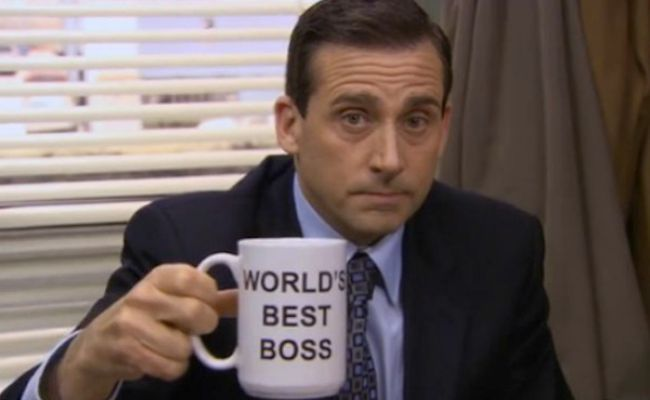

In the TV show *The Office*, the boss Michael Scott had a coffee mug with the words "*The world's best boss*" written on it. This, of course, was meant to be a joke, but there's some element of truth in it. In his workplace, Michael Scott did not create dependency, he created opportunity by allowing employees to dance to their own tune.

::: {.gray-text .center-text}
{fig-align="center"}
:::

A business needs to have motivated employees to grow and become successful. When employees aren’t motivated, their quality of work suffers. So how do you, as a boss, ensure your employees stay motivated?

The biggest mistake most bosses make is bossing people around. They are constantly telling workers what to do.

> When you constantly tell your workers what to do, you create dependency. When you give them freedom to pursue their ideas, you create opportunity.

Always telling workers what to do doesn't give them time to pursue their ideas. That's because they'll be too dependent on you. This is a dangerous situation because, let's face it, you don't have all the answers. You won’t be right all the time.

However, when you create opportunities, you encourage workers to bring new ideas to their work. This subsequently improves the outcome of your work as a boss.

> Opportunity allows people to try out new things and in new things comes breakthroughs.

Don't be the stereotypical boss who always commands people to dance to your tune. Be like Michael Scott and allow your workers to sometimes dance to their own tune and you'll be surprised at how much they can achieve. After all, their success is yours too.