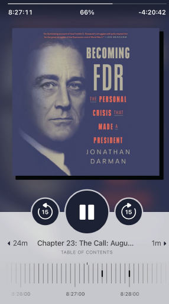

I’m a huge fan of the Libby App by the company *OverDrive, Inc*. I have used it exclusively for my digital book consumption since 2022.

A few weeks ago, I discovered an interesting feature in the app that allows you to export your timeline data. This data contains a list of all the books you’ve read using the app.

For a data nerd like me, this was catnip. I did the logical thing and downloaded the data. Here’s my first stab at trying to make sense of the data. In the code below, I’m reading five random rows.

```{python}
import polars as pl
import polars_xdt as xdt
from pathlib import Path

books = pl.read_parquet(f"{Path('../../../')}/datasets/books.parquet")
books.sample(5)
```
<br>
To begin with, I wanted to know which month I’d read books most. I could tell you it was May, but that wouldn’t be interesting. I’ve created a bar plot to make it interesting because that’s what data nerds do. Here it is so you can feed your eyes.

```{python}
month_df = (books
 .with_columns(month=xdt.month_name('timestamp'),
               month_num=pl.col('timestamp').dt.month())
 .group_by('month')
 .agg(pl.len(), pl.first('month_num'))
 .sort('month_num')
 .drop('month_num')
 .to_pandas()
)

from matplotlib import pyplot as plt
plt.rc('font', size=6)

fig, ax = plt.subplots(figsize=(6.5,4), facecolor='#631A35', dpi=120)
ax.spines[['left','top','right']].set_visible(False) #turn off all spines
ax.set_facecolor('#631A35')

bc = ax.bar('month', 'len', data=month_df, width=.8, color='#22a59c')
ax.bar_label(bc, color='white')  # Set color of bar labels to white
ax.xaxis.set_tick_params(
    rotation=0,
    bottom=False,
    length=0,
    pad=5,
    colors='#ffffff'
)
from matplotlib.ticker import MultipleLocator
ax.yaxis.set_major_locator(MultipleLocator(5)) #changes y-axis scale.
ax.margins(y=.2) #changes space of numbers in y-axis
fig.suptitle('Books finished\n(2022-2024)',
             fontsize=12, color='#ffffff', weight=700, y=.875)
ax.yaxis.set_tick_params(labelleft=False)
ax.yaxis.set_tick_params(left=False) #remove y-ticks
ax.set_xlim(-.5, len(ax.containers[0]) - .5) #reduce gap between y-axis line and first bar.
fig.tight_layout()
```
<br>

::: {.callout-note}
Notice that I used colors from the Libby app. I couldn’t leave my design itch unscratched.
:::

It looks like September hasn’t been a good month for my reading. What on earth have I been doing in September?! Goodness me, October doesn’t even appear!

You’re probably asking what exactly these books are that I’ve been reading. Well, listing all 100-plus books would be boring. But here are 10 books I enjoyed (of course, in no particular order).

```{python}
#| echo: false
ten_books_list = ["The Fund","We're Going to Need More Wine","Amusing Ourselves to Death",
                  "Empire of Pain","Future Shock","Woke, Inc.","Where Good Ideas Come From",
                  "Unbreak My Heart","My Life","How to Fly a Horse"]

enjoyed_books = (books
 .drop('timestamp')
 .filter(pl.col.title.is_in(ten_books_list))
 .unique('title')
 .sort('title')
 .with_row_index(offset=1)
 )
```

Again, simply listing the books would leave my design itch unscratched, so here’s a beautiful table containing the books.

```{python}
from great_tables import GT, md, html

display(
    GT(enjoyed_books, rowname_col="index")
    .tab_header(title=html("<h2>10 Books I Enjoyed</h2>"))
    .tab_source_note(
        source_note=md("**Source**: My Libby App")
    )
    .tab_options(table_background_color="#631A35")
    .tab_options(container_width = "95%",
                 heading_background_color = '#631A35',
                 column_labels_background_color="#22a59c",
                 source_notes_background_color="#22a59c")
    .cols_label(title=html("<b>Title"),
                author=html("<b>Author"),
                )
    .cols_width(cases={'index':'10px'})            
)
```
<br>

On another note, I didn’t know much about Bill Clinton’s life apart from the fact that he was president. But my goodness did he have an illustrious (and interesting) life. Moreover, he’s a fantastic storyteller. I really enjoyed his book *My Life*. This quote from the book really hit me:

> The river of time carries us all away. All we have is the moment.

Speaking of the moment, what am I reading now? I can just mention the book, but a picture is worth a thousand words, so here’s a screenshot from my iPhone.

::: {.gray-text .center-text}
{fig-align="center"}
:::

*Becoming FDR* is an interesting account of the first-ever disabled person to be the president of the United States. I'm 66% done with the book and so far, it's been a page-turner.

Much of what I knew about Franklin D Roosevelt was about his presidency. Knowing about his earlier life was fascinating. I didn't know, for instance, that he was considered a very handsome man in his early years. Or that he had a brother who was over 30 years older than him. That's like having a father for a brother!

This quote stood out for me:

> Hope is the scaffolding that protects the traumatized mind.

When Roosevelt had infantile paralysis, which we now know as polio, and lost his ability to walk, he was devastated. Hope was what kept him going.

What do you think about my book list? What book are you currently reading? Email me. I'd love to hear from you!