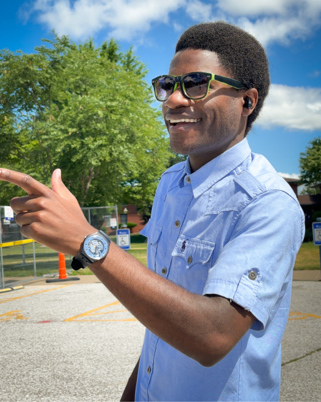

In a world where everyone constantly seeks attention, getting people to pay attention to you has become very difficult. We all feel the need to be noticed.

::: {.gray-text .center-text}
{fig-align="center"}
:::

You're probably on social media because you want to be noticed by other people. You want them to like your post, comment on it, and even share it.

Being noticed is a dopamine hit and we crave it. The philosopher William James said:

> If you were to lead a life without being noticed, it would feel worse than torture.

But if everyone is demanding attention, who will offer their attention to someone else? The answer is probably no one.

Taming the desire for recognition and attention is hard. We want people to like us; to pay attention to the stuff we're doing, the posts we're sharing, the videos we're creating, and so on. It's what keeps us going.

When multiple people like you post, you feel validated and motivated to post again. However, when everyone ignores your post, you don’t see the point of posting again.

That's why it's important to be your own fan because everyone else is too busy seeking attention to themselves. Champion your work because no one else will do it for you.