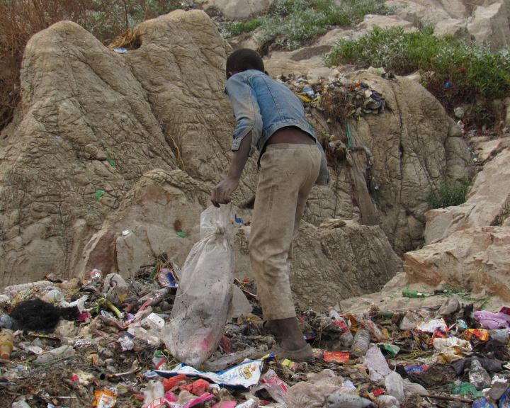

The media loves rags-to-riches stories because they capture a lot of eyeballs on TV, the Internet, or in newspapers and magazines. The reason they capture many eyeballs is that we enjoy these stories. We fetishize any headline that reads: “*Self-Made Man*” or “*The Woman Who Started from Humble Beginnings*”.

Most successful people today like to put up the narrative that they were once poverty-stricken. They want everyone to know that they started from the bottom and now they’re here.

But poverty should never be something to fantasize about. Most people in poverty right now are trying their best every day of their lives to come out of it. Those who have come out of it work even harder so they don’t get into poverty again. I've experienced poverty before and I sure hope I never experience it again. It's one thing to read about it, experiencing it is a whole different thing.

::: {.gray-text .center-text}
{fig-align="center"}
:::

To be clear I'm not against the media publishing rags-to-riches stories. These stories give hope to our brothers and sisters in poverty, reminding them that they can also rise to the top.

The angle with which the media approaches rags-to-riches stories is what I take issue with. It's as if the writers of these stories want to tell us that the subjects of the stories succeeded because of poverty. What they really should be telling us is that these people succeeded despite living in poverty. The latter approach changes the whole narrative because it stops naive people from thinking that experiencing poverty leads to success.

Everyone wishes to make their own fortune and become a self-made person. But if you ask any poverty-stricken person to choose between being born in wealth or poverty just so they can be a self-made person someday, I guarantee you that every one of them would choose to be born in wealth.

I'm not denying that the prestige of being a self-made person is more satisfying than inheriting your parent's riches. However, having experienced poverty firsthand, I can attest that the difference in satisfaction is nothing compared to the pain that comes with living in poverty.

> Poverty is like a giant break that stops the acceleration of every poor person's dreams. Even worse, the pain of poverty is so great that it prevents many people from working on their dreams.

Poverty shuts many doors of opportunity and makes it almost impossible for you to take advantage of the few doors left open. All rags-to-riches stories are just outliers because most poverty-stricken people never get to the top.