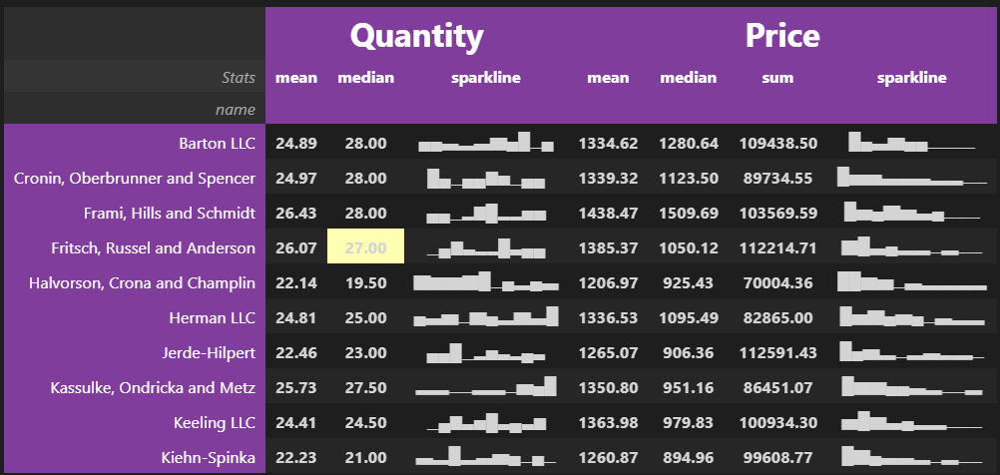

I am a sucker for visually appealing things, and I try as much as I can to embody that in my data analysis work. In this article, I'll show you how you can style your pandas dataframes to make them look pretty and enhance their message.

::: {.gray-text .center-text}
{fig-align="center"}
:::

### Why care about styling?

Styling allows you to change the look of the data in your dataframe columns while maintaining the data types. This enables you to perform mathematical operations on columns that may otherwise contain strings-like symbols like % and $.

The most common and straightforward example of styling is using currency symbols when working with monetary values. For instance, when you have 95.05, you likely won't immediately understand it as a monetary amount. By contrast, when you see it as $95.05, the first thing that will come to your mind is that this is a monetary amount.

Percentages are another example of numbers whose message is enhanced when styling is used. Interpreting 7 percent is easier when it's written as 7% than when it's written as 0.07.

Pandas styling enhances the message of the values in your dataframe, making it easier for your audience to understand the message of those values. More importantly, it doesn’t change the data types of those values allowing you to perform mathematical operations on them.

### The dataset

The dataset for this task will be the 2018 sales data for various companies in the United States.

```{python}
import pandas as pd
from pathlib import Path

df = (pd.read_parquet(f"{Path('../../../')}/datasets/sales_total_2018.parquet")
 .rename(columns=lambda col: col.replace(' ', '_'))
 )
df.sample(6)
```

<br>
Let’s extract summary statistics like the mean (average) and sum of the price data for the six random companies in our dataset. I’ll usegroupbyand agg methods to achieve this.


```{python}
(df
 .groupby('name')
 .ext_price
 .agg({'mean','sum'})
 .sample(6)
 )
```

### Styling the dataframe

When you look at the data in the above dataframe, you notice that the summed values are significantly larger, and the averaged values have 6 decimal points. This makes it harder to understand the scale of the numbers, and the table isn’t aesthetically pleasing.

To solve these problems, we turn to `style` which converts the table from a pandas dataframe to a style object. The style object is not as rigid as a pandas dataframe, in that you can use `format` to change the look of its values.

I’ll use Python’s f-strings to convert the data into currency values and round them to 2 decimal places. If I wanted to round to a whole number (0 decimal places), I would’ve used this f-string `${0:,.0f}`.

```{python}
(df
 .groupby('name')
 .ext_price
 .agg({'mean','sum'})
 .sample(6)
 .style
 .format('${0:,.2f}')
 )
```

### More styling

Let’s take our styling up a notch and deal with dates. I’ll use `pd.Grouper` to get the total sales for each month. Then I’ll calculate how much each month is as a percentage of the total annual sales.

```{python}
(df
 .groupby(pd.Grouper(key='date', freq='ME'))
 .ext_price
 .agg('sum')
 .to_frame()
 .assign(pct_total=lambda df_: df_.ext_price / df_.ext_price.sum())
 .rename(columns={'ext_price':'sum'})
 )
```

<br>

I’m not interested in showing the date in its full format. Once again, I’ll use f-strings to display the date like “Jan-2018” instead of “2018-01-31”. I’ll also add the % symbol to the values in percentage total column. Now, let’s style the date to get the desired dataframe.

```{python}
(df
 .groupby(pd.Grouper(key='date', freq='ME'))
 .ext_price
 .agg('sum')
 .to_frame()
 .assign(pct_total=lambda df_: df_.ext_price / df_.ext_price.sum())
 .rename(columns={'ext_price':'sum'})
 .reset_index()
 .style
 .format({'date':'{:%b-%Y}','sum':'${0:,.0f}','pct_total':'{:.2%}'})
 .hide()
 )
```

<br>

By the way in addition to using `pd.Grouper` we can use `resample` on timeseries data to get an identical dataframe to the one above.

```{python}
(df
 .set_index('date')
 .resample('ME')
 [['ext_price']]
 .sum()
 .assign(pct_total=lambda df_: df_.ext_price / df_.ext_price.sum())
 .rename(columns={'ext_price':'sum'})
 .reset_index()
 .style
 .format({'date':'{:%b-%Y}','sum':'${0:,.0f}','pct_total':'{:.2%}'})
 .hide()
 )
```

::: {.callout-note}
To use `resample` you must set the date column as the index of your dataframe.
:::

If you have an observant eye, you’ll notice that the above dataframe doesn’t have an index. That’s because use used the `hide` method. It suppresses the index.

Manipulating the look of your dataframe is useful when developing final output reports. Usually, the index of the dataframe serves no purpose in the final report.

Colors can be useful when directing attention to specific parts of the report like the lowest or highest sales values. Let me highlight the highest and lowest values to see which months had the highest and lowest sales. I’ll use red for the lowest and green for the highest.

```{python}
(df
 .set_index('date')
 .resample('ME')
 [['ext_price']]
 .sum()
 .assign(pct_total=lambda df_: df_.ext_price / df_.ext_price.sum())
 .rename(columns={'ext_price':'sum'})
 .reset_index()
 .style
 .format({'date':'{:%b-%Y}','sum':'${0:,.0f}','pct_total':'{:.2%}'})
 .hide()
 .highlight_max(color='darkgreen', subset=['sum','pct_total'])
 .highlight_min(color='red', subset=['sum','pct_total'])
 )
```

<br>

You can also use `background_gradient` to highlight the range of values in a column. Let’s do it for the sum column. I’ll use `subset` to pick the column and `cmap` to choose a color palette for the gradient. 

```{python}
(df
 .set_index('date')
 .resample('ME')
 [['ext_price']]
 .sum()
 .assign(pct_total=lambda df_: df_.ext_price / df_.ext_price.sum())
 .rename(columns={'ext_price':'sum'})
 .reset_index()
 .style
 .format({'date':'{:%b-%Y}','sum':'${0:,.0f}','pct_total':'{:.2%}'})
 .hide()
 .background_gradient(cmap='BuGn', subset='sum')
 )
```

<br>

Another cool thing you can do with styling is draw bar charts within the columns to represent the values.

```{python}
(df
 .set_index('date')
 .resample('ME')
 [['ext_price']]
 .sum()
 .assign(pct_total=lambda df_: df_.ext_price / df_.ext_price.sum())
 .rename(columns={'ext_price':'sum'})
 .reset_index()
 .style
 .format({'date':'{:%b-%Y}','sum':'${0:,.0f}','pct_total':'{:.2%}'})
 .hide()
 .bar(color='#ffa348', vmin=100_000, subset=['sum'], align='zero')
 .bar(color='#c061cb', vmin=0, subset=['pct_total'], align='zero')
 .set_caption('Sales performance (2018)')
 )
```

<br>

In the code above I use `bar` and some parameters to configure the display of the bars in the columns. Using `set_caption` allows me to add a title to the table.

### Advanced styling

All the styling we’ve done thus far can be exported to Excel and the styling will be reflected in the Excel file. Unfortunately, the advanced styling we’ll do from here won’t be maintained when the file is exported to Excel. Since the styling will involve HTML and CSS features, you can export it as an HTML file and the styling will be maintained.

Let’s create a table that shows the top 10 companies by sales value. Then we’ll get the average and median of their `quantity`; and average, median, and sum of their `ext_price`.

To create sparklines, I’ll use the library `sparklines` and `numpy`.

```{python}
from sparklines import sparklines
import numpy as np

# function to create sparklines
def sparkline(x):
    bins=np.histogram(x)[0]
    sl = ''.join(sparklines(bins))
    return sl
sparkline.sparklines = 'sparkline'

# apply the function to modify the dataframe
data = (df
 .groupby('name')
 .agg({'quantity': ['mean', 'median', sparkline], 'ext_price': ['mean', 'median', 'sum', sparkline]})
 .head(10)
 )
data.columns.names=['','Stats']

# mapping for renaming
rename_mapping = {
    'quantity': 'Quantity',
    'ext_price': 'Price'
}

# renaming the levels
data.columns = data.columns.set_levels(
    [rename_mapping.get(item, item) for item in data.columns.levels[0]], level=0
)

data
```

<br>

You’ll notice that the table above is multi-column i.e., there are two levels of columns. I’ll add sparklines to the second level of columns. These will be under both quantity and price. I’ll also rename the top columns as `Quantity` and `Price` . Then I’ll add a label `Stats` to show what the second level of columns mean.

Let’s add some HTML and CSS styling to make our table more stunning. I’ll format all the numbers to 2 decimal places. The background color for the header will be purple and I’ll increase the font size for the names of the top columns.

```{python}
# set the HTML and CSS styles
cell_hover = {  # for row hover use <tr> instead of <td>
    'selector': 'td:hover',
    'props': [('background-color', '#ffffb3')]
}
index_names = {
    'selector': '.index_name',
    'props': 'font-style: italic; color: darkgrey; font-weight:normal;'
}
headers = {
    'selector': 'th:not(.index_name)',
    'props': 'background-color: #813d9c; color: white;'
}

# apply the HTML and CSS styling
(data
 .style
 .format({('Quantity', 'mean'): "{:.2f}",
          ('Quantity', 'median'): "{:.2f}",
          ('Price', 'mean'): "{:.2f}",
          ('Price', 'median'): "{:.2f}",
          ('Price', 'sum'): "{:.2f}"})
 .set_table_styles([cell_hover, index_names, headers])
 .set_table_styles([{'selector': 'th.col_heading', 'props': 'text-align: center;'},
                    {'selector': 'th.col_heading.level0', 'props': 'font-size: 2em;'},
                    {'selector': 'td', 'props': 'text-align: center; font-weight: bold;'}], overwrite=False)
 )
```

<br>

This is the type of table you would want to display on your website. What's more, it has cell highlighting when you hover over a cell.

Styling this final table required a lot of work, but I’m sure you’ll agree that it’s nothing short of beautiful. You almost can’t stop looking at it.