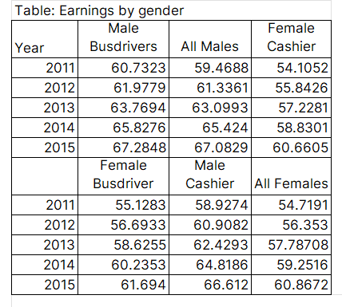

Most people don't think about tables when they think about data visualization. But tables deserve as much attention as you put in your charts. To effectively communicate the message in your data, it's important to understand the rules for presenting data in tables.

Let me load the dataset so we can see the raw data.
```{python}
import polars as pl
import polars.selectors as cs
from pathlib import Path

df = pl.read_parquet(f"{Path('../../../')}/datasets/gender_earnings.parquet")
df
```
<br>

Now let me show you a poorly designed table that attempts to communicate some insights from the raw data, then I'll walk you through the process of improving it.

::: {.gray-text .center-text}
{#fig-table-1}
:::

@fig-table-1 shows all the data we need to see, yet it’s hard to understand what is going on. The message is not easily communicated, meaning you’ll have to spend more time on the table to understand the message.

To begin with, it has two headers that break in the middle of the table. There must be a way to combine these headers, especially since the values in *Year* are repeating.

We can also group columns based on the category. For example, cashier can have males (Men) and females (Women) together.

Let's see how incorporating the above points can make our table look better and thus communicate our message effectively. I'll use the `great-tables` library to redesign @fig-table-1.

```{python}
#| label: fig-table-2
#| fig-cap: a better designed table
#| fig-cap-location: margin

from great_tables import GT, html

(
    GT(df, rowname_col='Year')
    .tab_header(title=html("<h4>Average earnings for men and women,<br>overall and by occupation</h4>"))
    .cols_label(All_Males=html('<b style="color: grey;">Men</b>'),
                All_Females=html('<b style="color: grey;">Women</b>'),
                Male_Busdrivers=html('<b style="color: grey;">Men</b>'),
                Female_Busdriver=html('<b style="color: grey;">Women</b>'),
                Male_Cashier=html('<b style="color: grey;">Men</b>'),
                Female_Cashier=html('<b style="color: grey;">Women</b>'),
                )
    .tab_spanner(label=html("<b>All</b>"), columns=['All_Males', 'All_Females'])
    .tab_spanner(label=html("<b>Busdrivers</b>"), columns=['Male_Busdrivers', 'Female_Busdriver'])
    .tab_spanner(label=html("<b>Cashiers</b>"), columns=['Male_Cashier', 'Female_Cashier'])
)

```

In @fig-table-2 I removed the bottom header to only remain with one header and created hierarchies in that header. Reading from left to right, the first hierarchy in the header contains the values All, Busdrivers, and Cashiers. Since these values in the first hierarchy contain categories; men and women, I have grouped those categories under each of them.

The benefit of using a hierarchical table is that it gives insights into conditionals. For example, we can ask: What is the average wage for a cashier conditional on being a woman? Answering this question is easy when the data is presented like in @fig-table-2, but not in @fig-table-1.

We can increase the readability of @fig-table-2 by using adjusting whitespace between the spaces of the columns in the table.

We can further differentiate between the two hierarchies in the header with color. I'll use grey for the second hierarchy.

To make the appearance of numbers in the table consistent I'll round them all to 1 decimal place.

Lastly, I'll add a footnote to show the source of our data.

```{python}
#| label: fig-table-3
#| fig-cap: an even better designed table
#| fig-cap-location: margin

from great_tables import GT, md, html

set_width = '100px'
width_dict = {col: set_width for col in df.columns}

(
    GT(df, rowname_col='Year')
    .tab_header(title=html("<h4>Average earnings for men and women,<br>overall and by occupation</h4>"))
    .tab_source_note(
        source_note=md("**Note**: Data is simulated. The units is guavas.")
    )
    .cols_label(All_Males=html('<b style="color: grey;">Men</b>'),
                All_Females=html('<b style="color: grey;">Women</b>'),
                Male_Busdrivers=html('<b style="color: grey;">Men</b>'),
                Female_Busdriver=html('<b style="color: grey;">Women</b>'),
                Male_Cashier=html('<b style="color: grey;">Men</b>'),
                Female_Cashier=html('<b style="color: grey;">Women</b>'),
                )
    .tab_spanner(label=html("<b>All</b>"), columns=['All_Males', 'All_Females'])
    .tab_spanner(label=html("<b>Busdrivers</b>"), columns=['Male_Busdrivers', 'Female_Busdriver'])
    .tab_spanner(label=html("<b>Cashiers</b>"), columns=['Male_Cashier', 'Female_Cashier'])
    .fmt_number(columns=cs.float(), decimals=1, use_seps=False)
    .cols_width(cases=width_dict)
)
```

Enroll in my  to perfect your data analysis skills with this new and fast dataframe library.