Last week I visited my friend in Chicago. I hadn't seen him since we left university. It was also a convenient excuse for me to explore the city.

I had been to Chicago before, but I wouldn't say that I explored the city. Think of it like flying from the US to Brazil and getting a connecting flight in Mexico. Would you say that you've been to Mexico? No, you wouldn’t. Besides the first time I visited Chicago was in the winter—and Chicago winters are notorious for their harshness.

Anyway, I drove 3 hours to see my friend and Chicago did not disappoint. We were both glad to see each other after a long time. Coincidentally, we first met in Chicago, even though we attended the same school in a different city.

I spent two nights in Chicago and my friend and I visited many places. When I arrived it was a beautiful sunny day and the first thing we did was go to the beach.

Looking at people relaxing and enjoying themselves at the beach felt as if for a moment the world was free of all troubles.

::: {.gray-text .center-text}
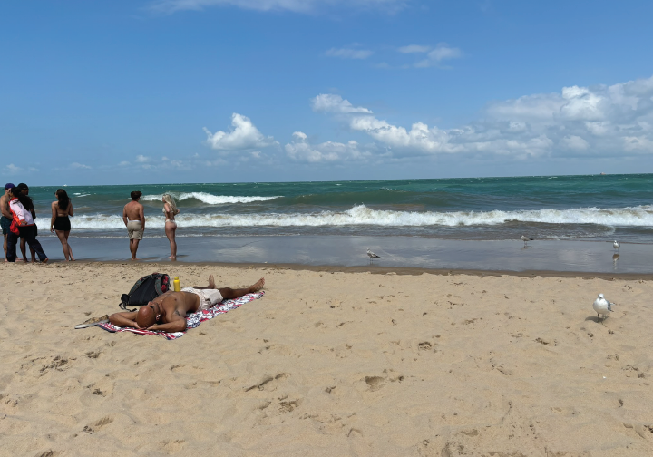{fig-align="center"}
:::

We also went to the Japanese store Mitsuwa where we had dinner and picked up some pastries. I also tried the tasty and refreshing drink called Honey & Lemon Suntory

::: {.gray-text .center-text}
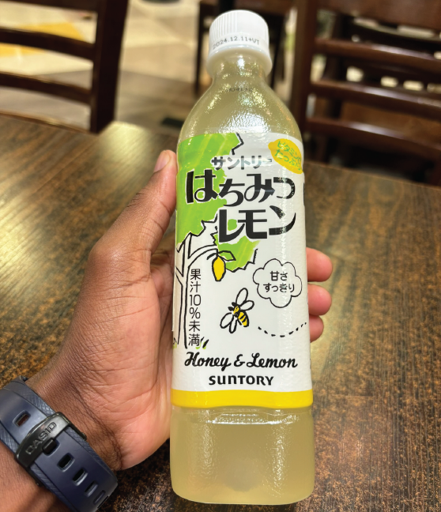{fig-align="center"}
:::

For dinner, I had Japanese rice with garlic chicken. The brown gravy on the side is probably the best I've ever had in my life.

::: {.gray-text .center-text}
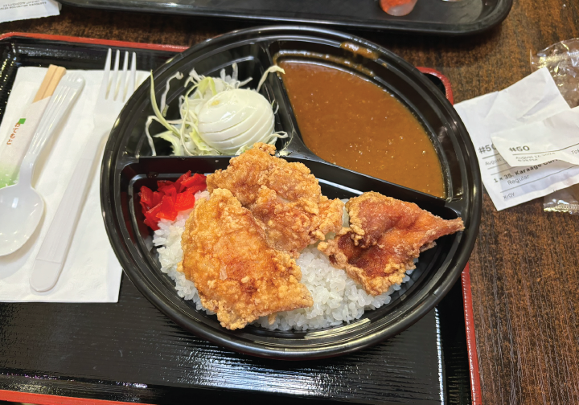{fig-align="center"}
:::

After dinner, we went to IKEA. It was my first time to be inside IKEA.

::: {.gray-text .center-text}
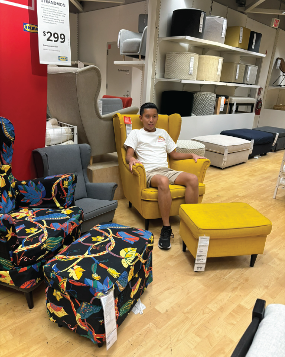{fig-align="center"}
:::

We didn't end up buying anything in IKEA, but the whole experience was worthwhile.

It was now time to head back home. The long drive from my place to Chicago had sucked the energy out of me. Fortunately, my friend was kind enough to drive us around the city.

::: {.gray-text .center-text}
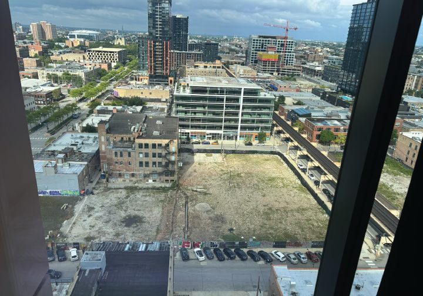{fig-align="center"}
:::

I also had a chance to visit the open area meant for relaxing and entertainment at the top floor of the apartment complex.

::: {.gray-text .center-text}
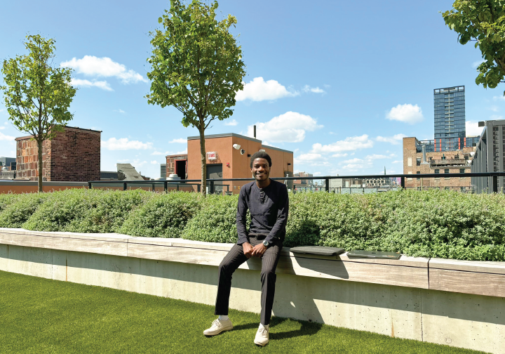{fig-align="center"}
:::

The following morning, my friend suggested we have breakfast at McDonald's headquarters, Hamburger University. On our way there, we stumbled on a car whose number plate is simply 1. My friend and I thought this was cool. We both took a picture of the car.

::: {.gray-text .center-text}
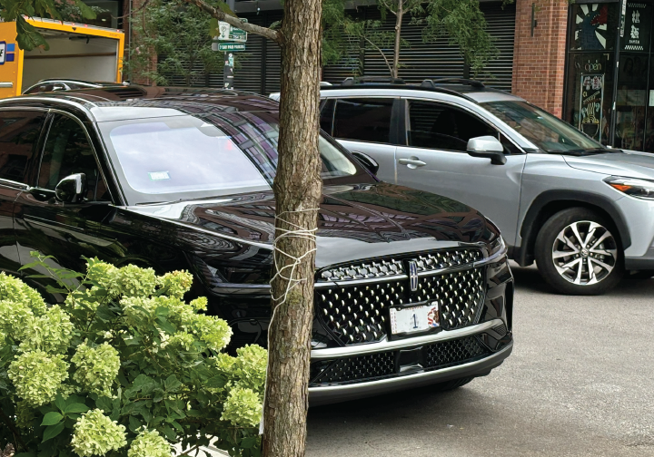{fig-align="center"}
:::

::: {.gray-text .center-text}
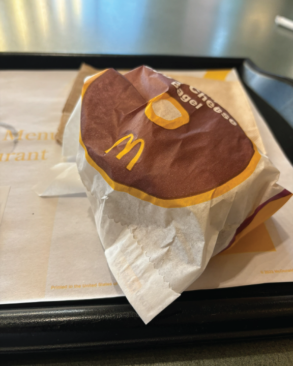{fig-align="center"}
:::

On our adventures in the city, we also walked past Trump Tower.

::: {.gray-text .center-text}
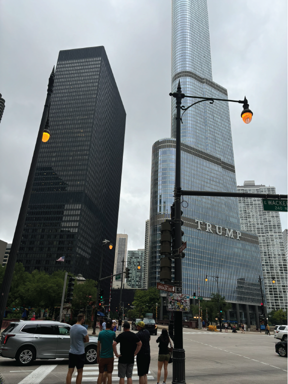{fig-align="center"}
:::

Then walked past the Chicago Tribune building.

::: {.gray-text .center-text}
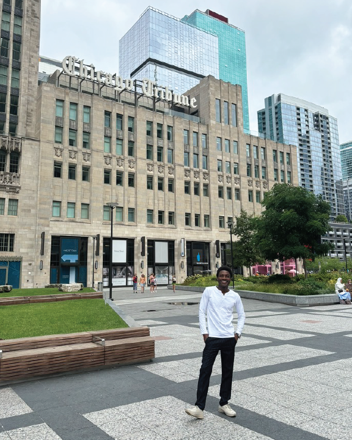{fig-align="center"}
:::

My friend is an Apple fanatic, so he suggested we visit the Apple Store. I was down for that and it did not disappoint. The slick nature of Apple products is also emulated in the Apple Store. I felt like I was inside an Apple gadget, as weird as that may sound.

Our next stop was the Starbucks Reserve. I'm not a coffee lover, in fact, I haven't drunk the beverage in years, but I appreciated the ambiance and the aesthetics inside the store.

My friend told me that Starbucks Reserves are special for there are only six in the entire world. Where are they located? In Seattle, Shanghai, Milan, New York, Tokyo, and Chicago.

::: {.gray-text .center-text}
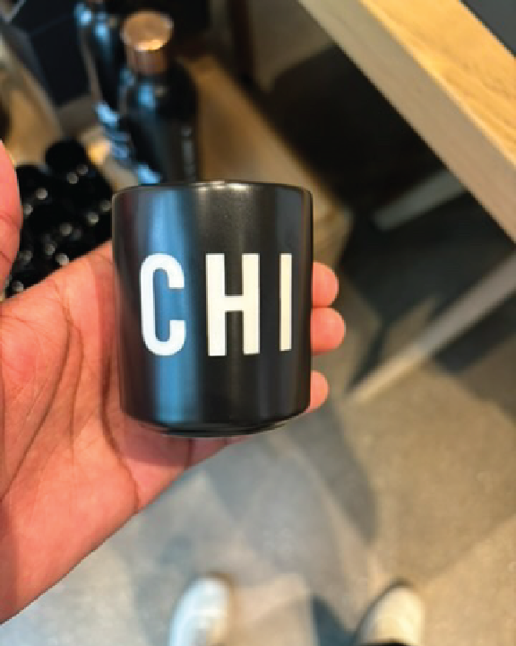{fig-align="center"}
:::

I also learned that the Chicago Starbucks Reserve was opened in 2019.

::: {.gray-text .center-text}
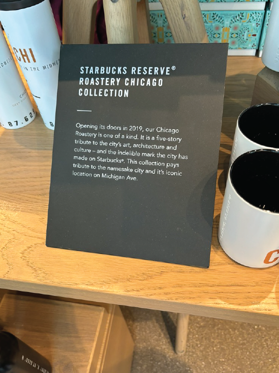{fig-align="center"}
:::

::: {.gray-text .center-text}
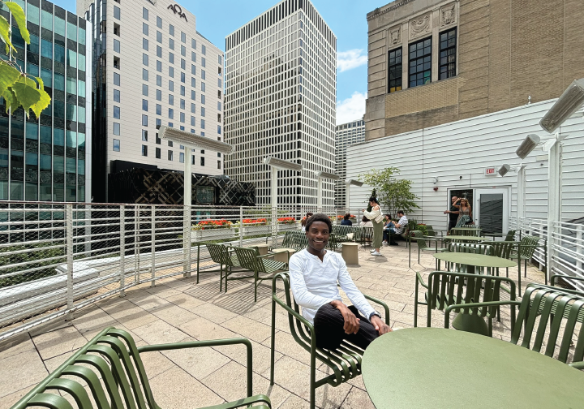{fig-align="center"}
:::

Because we had a great time at the beach the previous day, we did it again the following day. It was a windy day which made it fun to watch the massive waves on the lake.

Walking in the sand at the beach reminded me of the line from Kanye West's Homecoming.

*Baby, do you remember when fireworks at Lake Michigan?*  
*Oh, now I’m comin’ home again*  
*Maybe we could start again.*

The highlight of my Chicago visit was seeing the bean. Not only is it a beautiful piece of art, but also a marvelous piece of architecture. This was evident by the number of people taking pictures of it.

::: {.gray-text .center-text}
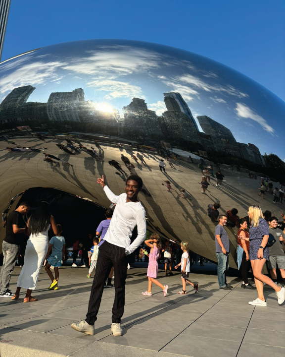{fig-align="center"}
:::

> The bean has grown into a knowledgeable witness. It has watched people from all corners of the world pose in front of it to take pictures. It observed the young, the old, the married, and the single lay eyes on it. It has kept a piece of every human who touched it by storing their fingerprints. It has watched friendships made, families reunite, and lovers kiss. It has provided not only physical but also psychological sanctuary.

On my last day in Chicago, my friend took me to Costco to pick up some groceries. He has a membership card. There, we had the famous Costco hot dogs for lunch.

::: {.gray-text .center-text}
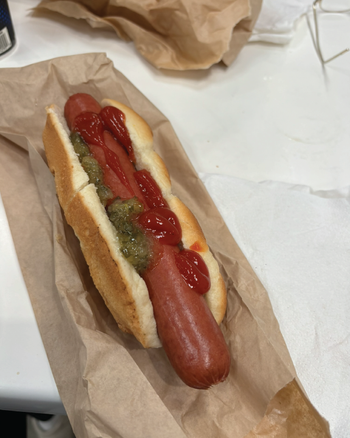{fig-align="center"}
:::

Seeing my friend in person after a long time was wonderful. Visiting the city of Chicago was marvelous. There is so much to see. I'd recommend with one caveat, *don’t* go there in the winter.