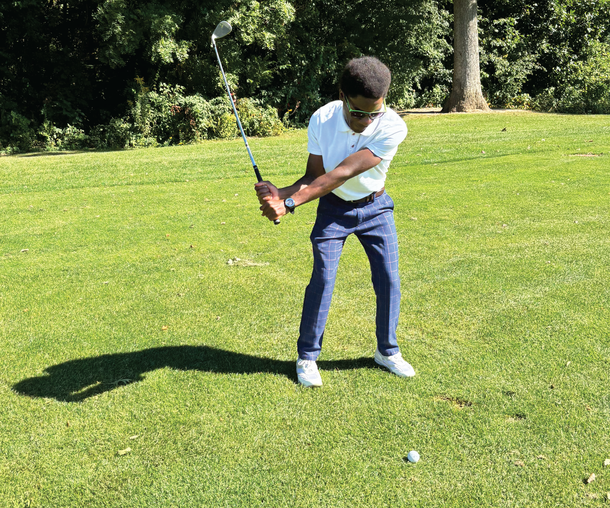

A few weeks ago, I played golf for the first time. It's an interesting sport, but it's definitely not a sport for the impatient.

::: {.gray-text .center-text}
{fig-align="center"}
:::

It turns out that I'm not good at golf surprise, surprise! But it was still fun to play. My swing was laughable at first and tolerable at the end of the game. Deliberate practice truly does make perfect (or tolerable, in my case). I watched one guy who was 3 standard deviations better than me play and I mimicked him. It helped me a little. Let's just I have to put in my 10,000 hours to be on the same level as him.

While on the golf course, I remembered the golf metaphor my professor in grad school regularly used to explain gradient-boosted models in machine learning. The metaphor didn't make sense then as I had never played a game of golf, but suddenly it made sense.

Think of boosting in golf terms with `XGBoost`. Your first shot (one tree) represents an initial attempt to get the ball (your prediction) toward the hole (the target). Subsequent shots (additional trees) help correct the ball's path, adjusting for any errors, and gradually guiding it closer to the hole.

You’ll agree that getting the ball in the hole on the first hit is difficult unless you're Tiger Woods—this is similar to what a standard decision tree model tries to do. In contrast, a gradient-boosted model like `XGBoost` takes multiple shots, with each one adjusting the ball’s direction until it eventually reaches the hole.

On that golf course, I understood why gradient-boosted models almost always perform better in machine learning competitions on Kaggle.

Check out my  with Polars where I walk you through the process of cleaning your data, training, and tuning your model and finally making predictions.